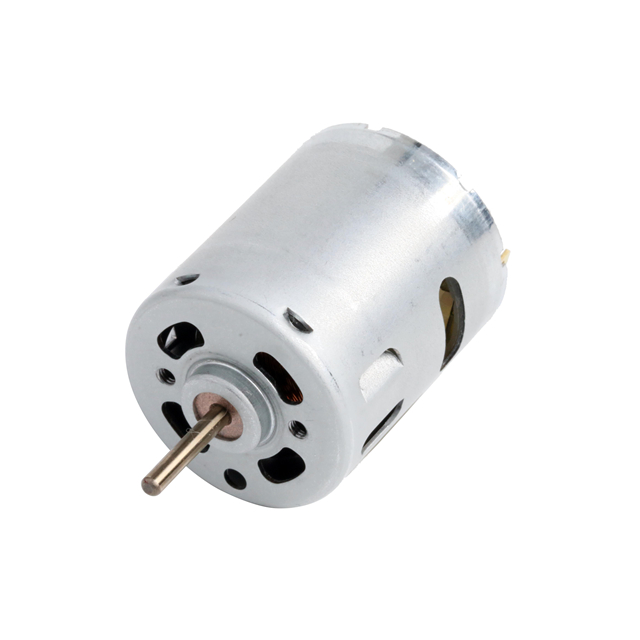
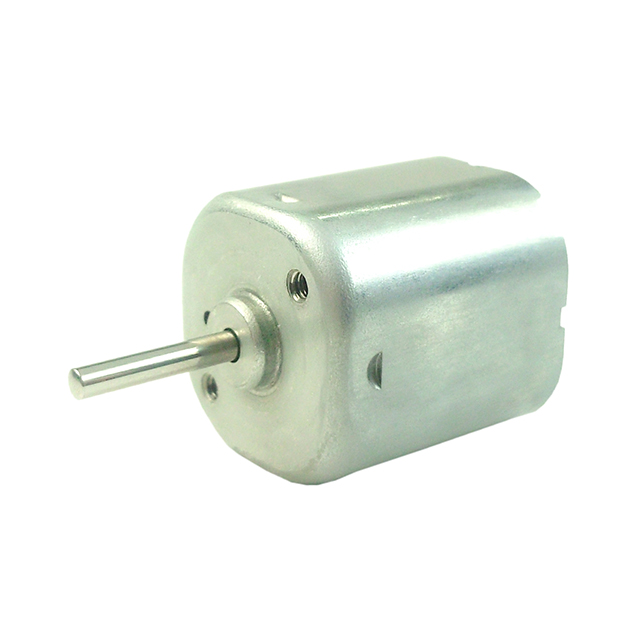
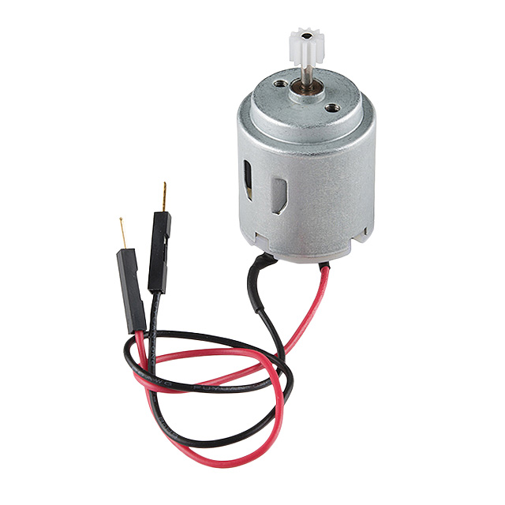
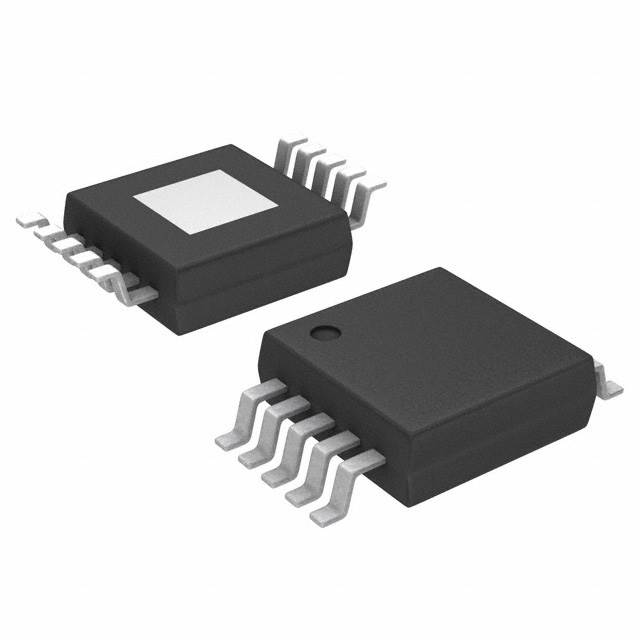
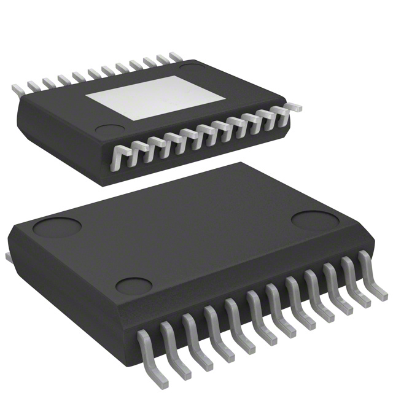
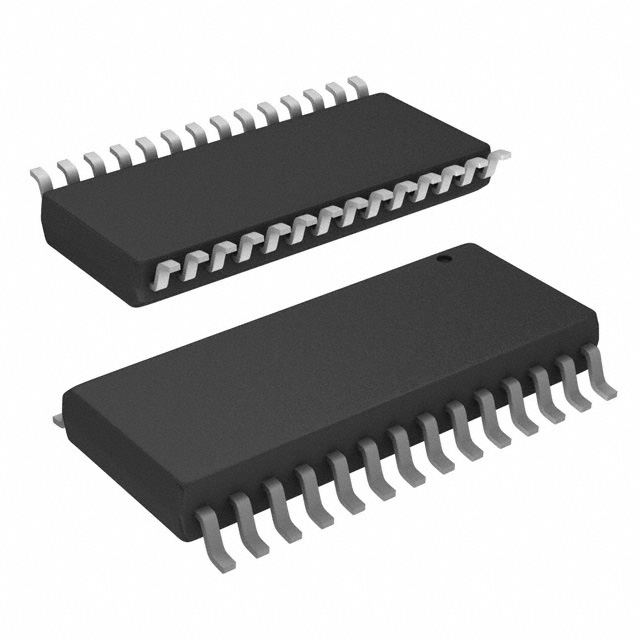
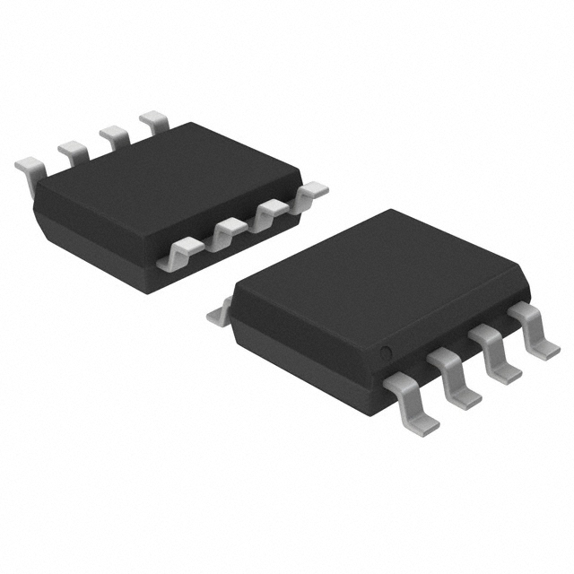
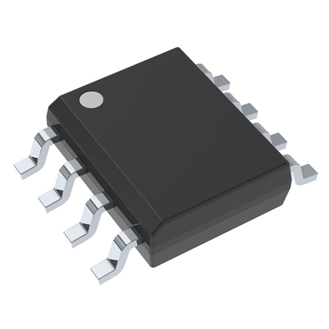
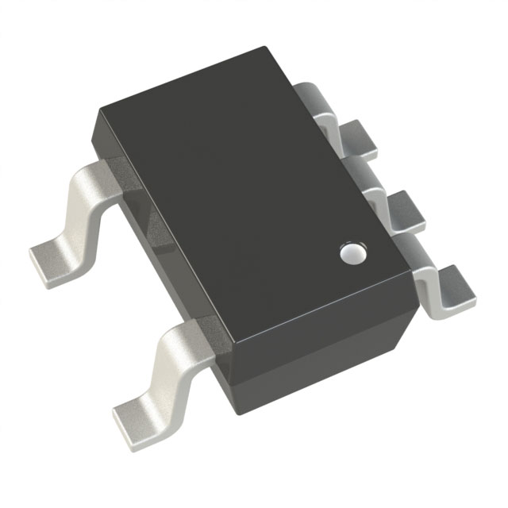

# **Component Selection**

## **Major Components**
For the motor drive subsystem, the main components will be the motors and the motor driver. We also need to think about the system's power source as well as regulating that power so our components do not burn. This system will be using a PIC Microcontroller from Microchip to communicate with the motor driver through Serial Peripheral Interface(SPI) or Inter-Integrated Circuit(I2C).

### **Brushed DC Motor**
| **Selected Product**     | **Rationale for Optimal Solution**                                              |
|------------------|-----------------------------------------------------------------------------------------|
| HC385G-302   {: style="max-width: 250px; max-height: 250px;" }   Price: $7.01   [Digikey](http://digikey.com/en/products/detail/johnson-motor/HC385G-302/12723725) / [Datasheet](https://www.johnsonelectric.com/pub/media/datasheetdownloadpdf/pdf/HC385G_302_metric_3__0.pdf) | This motor offers reliable and smooth performance for your 2-motor drive system, providing good speed and torque control. It’s ideal for medium-load applications and will integrate well with a 12V supply to drive your motors effectively, while its reliability ensures long-lasting performance in your system. |

#### Benchmarked Products
| Product          | Price | Links       | Pros                           | Cons                         |
|--|-------|-----------------|--------------------------------------|------------------------------------|
| SE18K1ETY   {: style="max-width: 250px; max-height: 250px;" } | $9.28 | [Digikey](https://www.digikey.com/en/products/detail/nmb-technologies-corporation/SE18K1ETY/6021449) / [Datasheet](https://mm.digikey.com/Volume0/opasdata/d220001/medias/docus/734/SE18K.pdf) | - Compact Size   - High Efficiency   - Durable         | - Limited Torque   - Relatively Expensive   - Requires Proper Heat Dissipation      |
| HC385G-302   {: style="max-width: 250px; max-height: 250px;" } | $7.01 | [Digikey](http://digikey.com/en/products/detail/johnson-motor/HC385G-302/12723725) / [Datasheet](https://www.johnsonelectric.com/pub/media/datasheetdownloadpdf/pdf/HC385G_302_metric_3__0.pdf) | - Versatile   - Reliable Performance   - Affordable    | - Size   - Lower Efficiency   - Not as Durable                                      |
| ROB-11696   {: style="max-width: 250px; max-height: 250px;" } | $2.10 | [Digikey](https://www.digikey.com/en/products/detail/sparkfun-electronics/ROB-11696/6163657) / [Datasheet](https://mm.digikey.com/Volume0/opasdata/d220001/medias/docus/951/ROB-11696_Web.pdf) | - Small and Lightweight   - Easy Integration   - Low Cost | - Low Torque   - Not Highly Durable   - Limited Speed Range                         |

### **Motor Driver**
| **Selected Product**     | **Rationale for Optimal Solution**                                              |
|------------------|-----------------------------------------------------------------------------------------|
| DRV8830DGQR   {: style="max-width: 250px; max-height: 250px;" }   Price: $2.09   [Digikey](https://www.digikey.com/en/products/detail/texas-instruments/DRV8830DGQR/2520903) / [Datasheet](https://www.ti.com/lit/ds/symlink/drv8830.pdf?HQS=dis-dk-null-digikeymode-dsf-pf-null-wwe&ts=1738989981632&ref_url=https%253A%252F%252Fwww.ti.com%252Fgeneral%252Fdocs%252Fsuppproductinfo.tsp%253FdistId%253D10%2526gotoUrl%253Dhttps%253A%252F%252Fwww.ti.com%252Flit%252Fgpn%252Fdrv8830) | The DRV8830DGQR motor driver is essential for controlling your 2-motor system. It can efficiently drive the motors, offering low power consumption and integrated fault protection. Given that you're working with a 12V supply and needing to control motors at lower voltages (like 3.3V for logic), this driver will provide smooth motor control while minimizing power loss and ensuring safety with overcurrent protection. |

#### Benchmarked Products
| Product          | Price | Links       | Pros                           | Cons                         |
|--|-------|-----------------|--------------------------------------|------------------------------------|
| NCV7719DQAR2G   {: style="max-width: 250px; max-height: 250px;" } | $5.99 | [Digikey](https://www.digikey.com/en/products/detail/onsemi/NCV7719DQAR2G/12529076) / [Datasheet](https://www.onsemi.com/download/data-sheet/pdf/ncv7719-d.pdf) | - Versatile Voltage Range   - Integrated Protection Features   - Low Power Consumption              | - Requires External Heat Sink for High Loads   - Limited Current Handling   - Can Be Sensitive to Voltage Spikes      |
| DRV8830DGQR   {: style="max-width: 250px; max-height: 250px;" } | $2.09 | [Digikey](https://www.digikey.com/en/products/detail/texas-instruments/DRV8830DGQR/2520903) / [Datasheet](https://www.ti.com/lit/ds/symlink/drv8830.pdf?HQS=dis-dk-null-digikeymode-dsf-pf-null-wwe&ts=1738989981632&ref_url=https%253A%252F%252Fwww.ti.com%252Fgeneral%252Fdocs%252Fsuppproductinfo.tsp%253FdistId%253D10%2526gotoUrl%253Dhttps%253A%252F%252Fwww.ti.com%252Flit%252Fgpn%252Fdrv8830) | - Small Package Size   - Low Power Consumption   - Integrated Fault Protection                     | - Limited Output Current   - Requires External Decoupling Capacitors   - May Overheat under High Loads               |
| NCV7708FDWR2G   {: style="max-width: 250px; max-height: 250px;" } | $5.83 | [Digikey](https://www.digikey.com/en/products/detail/onsemi/NCV7708FDWR2G/9829237) / [Datasheet](https://www.onsemi.com/pdf/datasheet/ncv7708f-d.pdf) | - High Efficiency   - Integrated Protection Features   - Robust for Motor Control Applications       | - Requires External Components for Full Operation   - Can be Sensitive to Temperature   - Limited to Specific Loads   |

### **Voltage Regulator**
| **Selected Product**     | **Rationale for Optimal Solution**                                              |
|------------------|-----------------------------------------------------------------------------------------|
|  MIC4680-3.3YM   {: style="max-width: 250px; max-height: 250px;" }   Price: $2.96   [Digikey](https://www.digikey.com/en/products/detail/microchip-technology/MIC4680-3-3YM/771689) / [Datasheet](https://ww1.microchip.com/downloads/en/DeviceDoc/mic4680.pdf) | The MIC4680-3-3YM voltage regulator is perfect for powering the logic components of your system from the 12V supply. It features low dropout voltage, meaning it will maintain stable 3.3V output even when the input voltage is slightly above 3.3V. This is crucial for your project, as it ensures that the microcontroller and other logic components get the consistent 3.3V they need to function, without worrying about inefficiencies or excessive heat that could arise from a less efficient regulator. |

#### Benchmarked Products
| Product          | Price | Links       | Pros                           | Cons                         |
|--|-------|-----------------|--------------------------------------|------------------------------------|
| LM2674MX-3.3/NOPB   {: style="max-width: 250px; max-height: 250px;" } | $3.37 | [Digikey](https://www.digikey.com/en/products/detail/texas-instruments/LM2674MX-3-3-NOPB/366902) / [Datasheet](https://www.ti.com/lit/ds/symlink/lm2674.pdf?HQS=dis-dk-null-digikeymode-dsf-pf-null-wwe&ts=1738969322841&ref_url=http%253A%252F%252Fwww.wjs2ic.com%252F){: style="max-width: 250px; max-height: 250px;" } | - High Efficiency   - Compact Size   - Reliable Voltage Regulation | - Requires External Components for Full Operation   - Limited Output Current   - May Require Heat Sinking |
| MIC4680-3.3YM   {: style="max-width: 250px; max-height: 250px;" }  | $2.96 | [Digikey](https://www.digikey.com/en/products/detail/microchip-technology/MIC4680-3-3YM/771689) / [Datasheet](https://ww1.microchip.com/downloads/en/DeviceDoc/mic4680.pdf) | - Low Dropout Voltage   - Wide Input Voltage Range   - Compact Design    | - Lower Output Current Rating   - May Require External Capacitors   - Performance Affected by Load Variation |
| ADPL44002AUJZ-3.3-R7   {: style="max-width: 250px; max-height: 250px;" } | $1.51 | [Digikey](https://www.digikey.com/en/products/detail/analog-devices-inc/ADPL44002AUJZ-3-3-R7/25803461) / [Datasheet](https://www.mouser.com/datasheet/2/609/1/adpl44002-3535120.pdf) | - High Precision   - Low Power Consumption   - Small Package | - Limited Output Current   - May Need Additional Filtering   - Can Be Sensitive to Temperature Changes |

### **Power Supply**
When choosing a power supply for this system, it's important to consider that the motors have the highest voltage requirements, meaning the battery may need to support not just this system but potentially others as well. I want something that isn't too bulky but still has enough power capacity to keep the project running efficiently. Given this, what type of power supply would be best? Should we use a battery pack consisting of AA or AAA batteries, which are easily replaceable but may not provide enough current? Or would a lithium battery be a better choice for higher capacity and rechargeability?

| **Selected Product**     | **Rationale for Optimal Solution**                                              |
|------------------|-----------------------------------------------------------------------------------------|
|  |  |

#### Benchmarked Products
| Product          | Price | Links       | Pros                           | Cons                         |
|--|-------|-----------------|--------------------------------------|------------------------------------|
|    {: style="max-width: 250px; max-height: 250px;" } |  | [Digikey]() / [Datasheet]() |  -   -   - |  -   -   - |
|    {: style="max-width: 250px; max-height: 250px;" } |  | [Digikey]() / [Datasheet]() |  -   -   - |  -   -   - |
|    {: style="max-width: 250px; max-height: 250px;" } |  | [Digikey]() / [Datasheet]() |  -   -   - |  -   -   - |

### **Microcontroller**
Since this subsystem will be using a PIC, the following table has been filled out to decide which ones can and/or will be used in the project

| ESP Info                                      | Answer |
| --------------------------------------------- | ------ | 
| Model                                         | PIC18F26K22 | 
| Product Page URL                              | [Product](https://www.microchip.com/en-us/product/PIC18F26K22#Documentation) |
| Datasheet URL(s)                              | [Microchip](https://ww1.microchip.com/downloads/aemDocuments/documents/MCU08/ProductDocuments/DataSheets/PIC18%28L%29F2X-4XK22-Data-Sheet-40001412H.pdf) |
| Application Notes URL(s)                      | [Documetation](https://www.microchip.com/en-us/product/pic18f26k22#Documentation)      |
| Vendor link                                   | [Purchase](https://www.microchip.com/en-us/product/pic18f26k22#Purchase)  |
| Code Examples                                 | [Documentation](https://www.microchip.com/en-us/product/pic18f26k22#Documentation)  |
| External Resources URL(s)                     | [Application Notes](https://www.microchip.com/en-us/product/pic18f26k22#Documentation)     |
| Unit cost                                     | $2.51 |
| Absolute Maximum Current for entire IC        | 25 mA |
| Supply Voltage Range                          | 1.8V and 5.5V |
| Absolute Maximum current   (for entire IC) | 25mA |
| Maximum GPIO current   (per pin)           | 25mA |
| Supports External Interrupts?                 | Yes  |
| Required Programming Hardware, Cost, URL      | [MPLAB® SNAP](https://www.microchip.com/en-us/product/pic18f26k22#Tools%20And%20Software) |
| Works with MPLabX?                            | Yes |
| Works with Microchip Code Configurator?       | Yes |

| Module | # Available | Needed | Associated Pins (or * for any) |
| ---------- | ----------- | ------ | ------------------------------ |
| GPIO       | 28          | 4      | GPIORA0, GPIORA1, GPIORA2, GPIORA3|
| ADC        | ?           | 0      | N/A                            |
| UART       | 2           | 1      | RX1C7, TX1C6                   |
| SPI        | 2           | 0      | N/A                            |
| I2C        | 2           | 2      | SCL1, SDA1, SCL2,SDA2          |
| PWM        | ?           | 0      | ?                              |
| ICSP       | ?           | 1      | ?                              |
| ...        | ...         | ...    | ...                            |

### **PIC Test**

