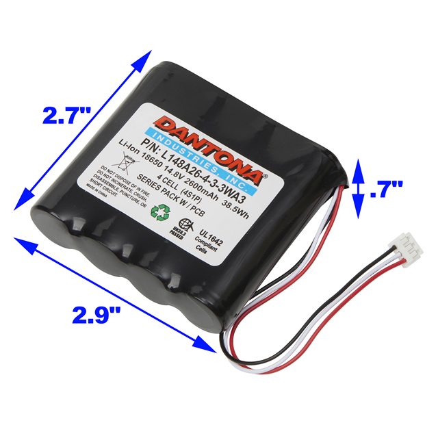
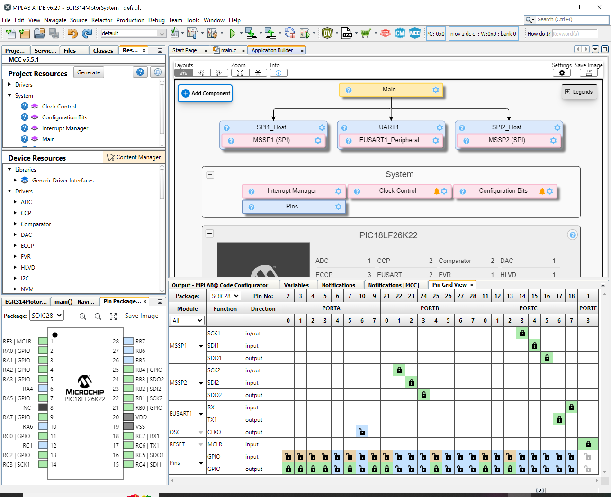

# **Component Selection**

## **Major Components**
For the motor drive subsystem, the main components will be the motors and the motor driver. We also need to think about the system's power source as well as regulating that power so our components do not burn. This system will be using a PIC Microcontroller from Microchip to communicate with the motor driver through Serial Peripheral Interface(SPI) or Inter-Integrated Circuit(I2C).

| **Selected Product**     | **Rationale for Optimal Solution**                                              |
|------------------|-----------------------------------------------------------------------------------------|
| SE18K1ETY   {: style="max-width: 250px; max-height: 250px;" }   Price: $9.28   [Digikey](https://www.digikey.com/en/products/detail/nmb-technologies-corporation/SE18K1ETY/6021449) / [Datasheet](https://mm.digikey.com/Volume0/opasdata/d220001/medias/docus/734/SE18K.pdf) | This motor can reliably operate from 3.3V to 15V depending on the system needed. It will provide enough torque to unsure the robot moves smoothly. |
| BTM9011EPXUMA1   {: style="max-width: 250px; max-height: 250px;" }   Price: $1.95   [Digikey](https://www.digikey.com/en/products/detail/infineon-technologies/BTM9011EPXUMA1/25702022) / [Datasheet](https://www.infineon.com/dgdl/Infineon-Infineon-BTM901xEP-DS-v01_00-EN-DataSheet-v01_00-EN.pdf?fileId=8ac78c8c90530b3a01912d365ee4326f) | The BTM9011EPXUMA1 motor driver is chosen for controlling a 2-motor system. It can efficiently drive the motors, accepting a wide range of power. It also connects through SPI interface allowing for easy connections between the microcontroller and motors. |
|  MIC4680-3.3YM   {: style="max-width: 250px; max-height: 250px;" }   Price: $2.96   [Digikey](https://www.digikey.com/en/products/detail/microchip-technology/MIC4680-3-3YM/771689) / [Datasheet](https://ww1.microchip.com/downloads/en/DeviceDoc/mic4680.pdf) | The MIC4680-3-3YM voltage regulator is perfect for powering the logic components of your system from the 12V supply. It features low dropout voltage, meaning it will maintain stable 3.3V output even when the input voltage is slightly above 3.3V. This is crucial for your project, as it ensures that the microcontroller and other logic components get the consistent 3.3V they need to function, without worrying about inefficiencies or excessive heat that could arise from a less efficient regulator. |
| 114090052   {: style="max-width: 250px; max-height: 250px;" }   Price: $1.49   [Digikey](https://www.digikey.com/en/products/detail/seeed-technology-co-ltd/114090052/10451909?gclsrc=aw.ds&&utm_adgroup=&utm_source=google&utm_medium=cpc&utm_campaign=Pmax_Shopping_Kemet_0399_Co-op&utm_term=&utm_content=&utm_id=go_cmp-21006314577_adg-_ad-__dev-c_ext-_prd-10451909_sig-CjwKCAiAt4C-BhBcEiwA8Kp0CS-VDejf0bi25snqRPutG9LRSwlgDfWQRWcZPSicBI7QqD0EbpzExhoC7U4QAvD_BwE&gad_source=1&gclid=CjwKCAiAt4C-BhBcEiwA8Kp0CS-VDejf0bi25snqRPutG9LRSwlgDfWQRWcZPSicBI7QqD0EbpzExhoC7U4QAvD_BwE&gclsrc=aw.ds) / [Datasheet](https://mm.digikey.com/Volume0/opasdata/d220001/medias/docus/338/114090052_Web.pdf?_gl=1*z21epr*_up*MQ..*_gs*MQ..&gclid=CjwKCAiAt4C-BhBcEiwA8Kp0CS-VDejf0bi25snqRPutG9LRSwlgDfWQRWcZPSicBI7QqD0EbpzExhoC7U4QAvD_BwE&gclsrc=aw.ds) | The 114090052 battery holder is the best choice because it is the cheapest option at only $1.49 while still meeting our voltage requirements when wired in series. Its compact and lightweight design helps keep our project from becoming too bulky, making it more practical. Additionally, it allows for easy battery replacement, avoiding the need for complex charging circuits like those required for lithium battery packs. |

### **Brushed DC Motor**
For the motors, I am using brushed DC motors since they are cheap and will be small enough for our robot to be nonintrusive. I needed to find a motor that would work off of the power coming from the battery pack, so I roughly estimated around 12VDC was the optimal solution through the power budget.

| **Selected Product**     | **Rationale for Optimal Solution**                                              |
|------------------|-----------------------------------------------------------------------------------------|
| SE18K1ETY   {: style="max-width: 250px; max-height: 250px;" }   Price: $9.28   [Digikey](https://www.digikey.com/en/products/detail/nmb-technologies-corporation/SE18K1ETY/6021449) / [Datasheet](https://mm.digikey.com/Volume0/opasdata/d220001/medias/docus/734/SE18K.pdf) | This motor can reliably operate from 3.3V to 15V depending on the system needed. It will provide enough torque to unsure the robot moves smoothly. |

#### Benchmarked Products
| Product          | Price | Links       | Pros                           | Cons                         |
|--|-------|-----------------|--------------------------------------|------------------------------------|
| SE18K1ETY   {: style="max-width: 250px; max-height: 250px;" } | $9.28 | [Digikey](https://www.digikey.com/en/products/detail/nmb-technologies-corporation/SE18K1ETY/6021449) / [Datasheet](https://mm.digikey.com/Volume0/opasdata/d220001/medias/docus/734/SE18K.pdf) | - Compact Size   - High Efficiency   - Durable         | - Limited Torque   - Relatively Expensive   - Requires Proper Heat Dissipation      |
| HC385G-302   {: style="max-width: 250px; max-height: 250px;" } | $7.01 | [Digikey](http://digikey.com/en/products/detail/johnson-motor/HC385G-302/12723725) / [Datasheet](https://www.johnsonelectric.com/pub/media/datasheetdownloadpdf/pdf/HC385G_302_metric_3__0.pdf) | - Versatile   - Reliable Performance   - Affordable    | - Size   - Lower Efficiency   - Not as Durable                                      |
| ROB-11696   {: style="max-width: 250px; max-height: 250px;" } | $2.10 | [Digikey](https://www.digikey.com/en/products/detail/sparkfun-electronics/ROB-11696/6163657) / [Datasheet](https://mm.digikey.com/Volume0/opasdata/d220001/medias/docus/951/ROB-11696_Web.pdf) | - Small and Lightweight   - Easy Integration   - Low Cost | - Low Torque   - Not Highly Durable   - Limited Speed Range                         |

### **Motor Driver**
To find our motor driver, I needed a driver that either works in I2C format or SPI format. It also needs to be able to provide enough power for our motors to avoid running them below optimal efficiency.

| **Selected Product**     | **Rationale for Optimal Solution**                                              |
|------------------|-----------------------------------------------------------------------------------------|
| BTM9011EPXUMA1   {: style="max-width: 250px; max-height: 250px;" }   Price: $1.95   [Digikey](https://www.digikey.com/en/products/detail/infineon-technologies/BTM9011EPXUMA1/25702022) / [Datasheet](https://www.infineon.com/dgdl/Infineon-Infineon-BTM901xEP-DS-v01_00-EN-DataSheet-v01_00-EN.pdf?fileId=8ac78c8c90530b3a01912d365ee4326f) | The BTM9011EPXUMA1 motor driver is chosen for controlling a 2-motor system. It can efficiently drive the motors, accepting a wide range of power. It also connects through SPI interface allowing for easy connections between the microcontroller and motors. |

#### Benchmarked Products
| Product          | Price | Links       | Pros                           | Cons                         |
|--|-------|-----------------|--------------------------------------|------------------------------------|
| NCV7719DQAR2G   {: style="max-width: 250px; max-height: 250px;" } | $5.99 | [Digikey](https://www.digikey.com/en/products/detail/onsemi/NCV7719DQAR2G/12529076) / [Datasheet](https://www.onsemi.com/download/data-sheet/pdf/ncv7719-d.pdf) | - Versatile Voltage Range   - Integrated Protection Features   - Low Power Consumption              | - Requires External Heat Sink for High Loads   - Limited Current Handling   - Can Be Sensitive to Voltage Spikes      |
| DRV8830DGQR   {: style="max-width: 250px; max-height: 250px;" } | $2.09 | [Digikey](https://www.digikey.com/en/products/detail/texas-instruments/DRV8830DGQR/2520903) / [Datasheet](https://www.ti.com/lit/ds/symlink/drv8830.pdf?HQS=dis-dk-null-digikeymode-dsf-pf-null-wwe&ts=1738989981632&ref_url=https%253A%252F%252Fwww.ti.com%252Fgeneral%252Fdocs%252Fsuppproductinfo.tsp%253FdistId%253D10%2526gotoUrl%253Dhttps%253A%252F%252Fwww.ti.com%252Flit%252Fgpn%252Fdrv8830) | - Small Package Size   - Low Power Consumption   - Integrated Fault Protection                     | - Limited Output Current   - Requires External Decoupling Capacitors   - May Overheat under High Loads               |
| NCV7708FDWR2G   {: style="max-width: 250px; max-height: 250px;" } | $5.83 | [Digikey](https://www.digikey.com/en/products/detail/onsemi/NCV7708FDWR2G/9829237) / [Datasheet](https://www.onsemi.com/pdf/datasheet/ncv7708f-d.pdf) | - High Efficiency   - Integrated Protection Features   - Robust for Motor Control Applications       | - Requires External Components for Full Operation   - Can be Sensitive to Temperature   - Limited to Specific Loads   |
| BTM9011EPXUMA1   {: style="max-width: 250px; max-height: 250px;" } | $1.95 | [Digikey](https://www.digikey.com/en/products/detail/infineon-technologies/BTM9011EPXUMA1/25702022) / [Datasheet](https://www.infineon.com/dgdl/Infineon-Infineon-BTM901xEP-DS-v01_00-EN-DataSheet-v01_00-EN.pdf?fileId=8ac78c8c90530b3a01912d365ee4326f) | -SPI Connection   - Accepts Wide Voltage Range   - works with 2 motors | -

### **Voltage Regulator**
Finding the right voltage regulator was tricky since I needed to take some large input voltage, around 12V DC, and bring it down to 3.3V in an efficient manner. Not only did I have to supply that, but when calculating the voltage using my batteries, I would be supplying around 14.8V, which would burn my motor, causing me to find a second regulator that creates a stable voltage of 12V.

| **Selected Product**     | **Rationale for Optimal Solution**                                              |
|------------------|-----------------------------------------------------------------------------------------|
|  MIC4680-3.3YM   {: style="max-width: 250px; max-height: 250px;" }   Price: $2.96   [Digikey](https://www.digikey.com/en/products/detail/microchip-technology/MIC4680-3-3YM/771689) / [Datasheet](https://ww1.microchip.com/downloads/en/DeviceDoc/mic4680.pdf) | The MIC4680-3-3YM voltage regulator is perfect for powering the logic components of your system from the 12V supply. It features low dropout voltage, meaning it will maintain stable 3.3V output even when the input voltage is slightly above 3.3V. This is crucial for your project, as it ensures that the microcontroller and other logic components get the consistent 3.3V they need to function, without worrying about inefficiencies or excessive heat that could arise from a less efficient regulator. |

#### Benchmarked Products
| Product          | Price | Links       | Pros                           | Cons                         |
|--|-------|-----------------|--------------------------------------|------------------------------------|
| LM2674MX-3.3/NOPB   {: style="max-width: 250px; max-height: 250px;" } | $3.37 | [Digikey](https://www.digikey.com/en/products/detail/texas-instruments/LM2674MX-3-3-NOPB/366902) / [Datasheet](https://www.ti.com/lit/ds/symlink/lm2674.pdf?HQS=dis-dk-null-digikeymode-dsf-pf-null-wwe&ts=1738969322841&ref_url=http%253A%252F%252Fwww.wjs2ic.com%252F){: style="max-width: 250px; max-height: 250px;" } | - High Efficiency   - Compact Size   - Reliable Voltage Regulation | - Requires External Components for Full Operation   - Limited Output Current   - May Require Heat Sinking |
| MIC4680-3.3YM   {: style="max-width: 250px; max-height: 250px;" }  | $2.96 | [Digikey](https://www.digikey.com/en/products/detail/microchip-technology/MIC4680-3-3YM/771689) / [Datasheet](https://ww1.microchip.com/downloads/en/DeviceDoc/mic4680.pdf) | - Low Dropout Voltage   - Wide Input Voltage Range   - Compact Design    | - Lower Output Current Rating   - May Require External Capacitors   - Performance Affected by Load Variation |
| ADPL44002AUJZ-3.3-R7   {: style="max-width: 250px; max-height: 250px;" } | $1.51 | [Digikey](https://www.digikey.com/en/products/detail/analog-devices-inc/ADPL44002AUJZ-3-3-R7/25803461) / [Datasheet](https://www.mouser.com/datasheet/2/609/1/adpl44002-3535120.pdf) | - High Precision   - Low Power Consumption   - Small Package | - Limited Output Current   - May Need Additional Filtering   - Can Be Sensitive to Temperature Changes |

### **Power Supply**
When choosing a power supply for this system, it's important to consider that the motors have the highest voltage requirements, meaning the battery may need to support not just this system but potentially others as well. I want something that isn't too bulky but still has enough power capacity to keep the project running efficiently. Given this, I decided to use 18650 lithium batteries, as they are relatively cheap due to being used in many products and have a great power storage capabilities seen through many hobbyist projects.

| **Selected Product**     | **Rationale for Optimal Solution**                                              |
|------------------|-----------------------------------------------------------------------------------------|
| 114090052   {: style="max-width: 250px; max-height: 250px;" }   Price: $1.49   [Digikey](https://www.digikey.com/en/products/detail/seeed-technology-co-ltd/114090052/10451909?gclsrc=aw.ds&&utm_adgroup=&utm_source=google&utm_medium=cpc&utm_campaign=Pmax_Shopping_Kemet_0399_Co-op&utm_term=&utm_content=&utm_id=go_cmp-21006314577_adg-_ad-__dev-c_ext-_prd-10451909_sig-CjwKCAiAt4C-BhBcEiwA8Kp0CS-VDejf0bi25snqRPutG9LRSwlgDfWQRWcZPSicBI7QqD0EbpzExhoC7U4QAvD_BwE&gad_source=1&gclid=CjwKCAiAt4C-BhBcEiwA8Kp0CS-VDejf0bi25snqRPutG9LRSwlgDfWQRWcZPSicBI7QqD0EbpzExhoC7U4QAvD_BwE&gclsrc=aw.ds) / [Datasheet](https://mm.digikey.com/Volume0/opasdata/d220001/medias/docus/338/114090052_Web.pdf?_gl=1*z21epr*_up*MQ..*_gs*MQ..&gclid=CjwKCAiAt4C-BhBcEiwA8Kp0CS-VDejf0bi25snqRPutG9LRSwlgDfWQRWcZPSicBI7QqD0EbpzExhoC7U4QAvD_BwE&gclsrc=aw.ds) | The 114090052 battery holder is the best choice because it is the cheapest option at only $1.49 while still meeting our voltage requirements when wired in series. Its compact and lightweight design helps keep our project from becoming too bulky, making it more practical. Additionally, it allows for easy battery replacement, avoiding the need for complex charging circuits like those required for lithium battery packs. |

#### Benchmarked Products
| Product          | Price | Links       | Pros                           | Cons                         |
|--|-------|-----------------|--------------------------------------|------------------------------------|
| BK-18650-PC8   {: style="max-width: 250px; max-height: 250px;" } | $6.06 | [Digikey](https://www.digikey.com/en/products/detail/mpd-memory-protection-devices-/BK-18650-PC8/2330515?gclsrc=aw.ds&&utm_adgroup=&utm_source=google&utm_medium=cpc&utm_campaign=Pmax_Shopping_Kemet_0399_Co-op&utm_term=&utm_content=&utm_id=go_cmp-21006314577_adg-_ad-__dev-c_ext-_prd-2330515_sig-CjwKCAiAt4C-BhBcEiwA8Kp0CQRKxumzJ53EujDq2but3fAQEFkDbbhzFzlO_2egjskEnngshLDDoRoCw-YQAvD_BwE&gad_source=1&gclid=CjwKCAiAt4C-BhBcEiwA8Kp0CQRKxumzJ53EujDq2but3fAQEFkDbbhzFzlO_2egjskEnngshLDDoRoCw-YQAvD_BwE&gclsrc=aw.ds) / [Datasheet](https://www.memoryprotectiondevices.com/datasheets/BK-18650-PC8/BK-18650-PC8-datasheet.pdf) | - Reliable holder   - Supports 18650 cells    - Durable design | - Requires separate cells   - Bulkier than others   - Higher cost |
| 114090052   {: style="max-width: 250px; max-height: 250px;" } | $1.49 | [Digikey](https://www.digikey.com/en/products/detail/seeed-technology-co-ltd/114090052/10451909?gclsrc=aw.ds&&utm_adgroup=&utm_source=google&utm_medium=cpc&utm_campaign=Pmax_Shopping_Kemet_0399_Co-op&utm_term=&utm_content=&utm_id=go_cmp-21006314577_adg-_ad-__dev-c_ext-_prd-10451909_sig-CjwKCAiAt4C-BhBcEiwA8Kp0CS-VDejf0bi25snqRPutG9LRSwlgDfWQRWcZPSicBI7QqD0EbpzExhoC7U4QAvD_BwE&gad_source=1&gclid=CjwKCAiAt4C-BhBcEiwA8Kp0CS-VDejf0bi25snqRPutG9LRSwlgDfWQRWcZPSicBI7QqD0EbpzExhoC7U4QAvD_BwE&gclsrc=aw.ds) / [Datasheet](https://mm.digikey.com/Volume0/opasdata/d220001/medias/docus/338/114090052_Web.pdf?_gl=1*z21epr*_up*MQ..*_gs*MQ..&gclid=CjwKCAiAt4C-BhBcEiwA8Kp0CS-VDejf0bi25snqRPutG9LRSwlgDfWQRWcZPSicBI7QqD0EbpzExhoC7U4QAvD_BwE&gclsrc=aw.ds) | - Compact design   - Lightweight   -Accepts 18650 cells | - Lower capacity   - May need replacements   - Less durable |
| L148A26-4-3-3WA3   {: style="max-width: 250px; max-height: 250px;" } | $33.44 | [Digikey](https://www.digikey.com/en/products/detail/dantona-industries/L148A26-4-3-3WA3/13692657) / [Datasheet](https://dantona.com/products/l148a26-4-3-3wa3/) | - High capacity   - Pre-assembled pack   - Long-lasting | - Most expensive   - Bulky design   - Overkill for project |

### **Microcontroller**
Since this subsystem will be using a PIC, the following table has been filled out to decide if the researched product can be used in the project. The PIC18LF26K22 has enough processing power in a compact size to suit our needs. It has plenty of extra I/O if needed and allows for 2 connections of any SPI, I2C or PWM combination. 

| ESP Info                                      | Answer |
| --------------------------------------------- | ------ | 
| Model                                         | PIC18F26K22 | 
| Product Page URL                              | [Product](https://www.microchip.com/en-us/product/PIC18F26K22#Documentation) |
| Datasheet URL(s)                              | [Microchip](https://ww1.microchip.com/downloads/aemDocuments/documents/MCU08/ProductDocuments/DataSheets/PIC18%28L%29F2X-4XK22-Data-Sheet-40001412H.pdf) |
| Application Notes URL(s)                      | [Documetation](https://www.microchip.com/en-us/product/pic18f26k22#Documentation)      |
| Vendor link                                   | [Purchase](https://www.microchip.com/en-us/product/pic18f26k22#Purchase)  |
| Code Examples                                 | [Documentation](https://www.microchip.com/en-us/product/pic18f26k22#Documentation)  |
| External Resources URL(s)                     | [Application Notes](https://www.microchip.com/en-us/product/pic18f26k22#Documentation)     |
| Unit cost                                     | $2.51 |
| Absolute Maximum Current for entire IC        | 25 mA |
| Supply Voltage Range                          | 1.8V and 5.5V |
| Absolute Maximum current   (for entire IC) | 25mA |
| Maximum GPIO current   (per pin)           | 25mA |
| Supports External Interrupts?                 | Yes  |
| Required Programming Hardware, Cost, URL      | [MPLAB® SNAP](https://www.microchip.com/en-us/product/pic18f26k22#Tools%20And%20Software) |
| Works with MPLabX?                            | Yes |
| Works with Microchip Code Configurator?       | Yes |

| Module | # Available | Needed | Associated Pins (or * for any) |
| ---------- | ----------- | ------ | ------------------------------ |
| GPIO       | 28          | 8     | GPIORA0, GPIORA1, GPIORA2, GPIORA3, GPIORA7, GPIORB0, GPIORC0, GPIORC2|
| ADC        | ?           | 0      | N/A                            |
| UART       | 2           | 1     | RX1C7, TX1C6                   |
| SPI        | 2           | 2      | SCK1, SDI1, SDO1, SCK2 SDI2,SDO2         |
| I2C        | 2           | 2      | N/A         |
| PWM        | ?           | 0      | N/A                               |
| ICSP       | 1           | 1      | MCLR, PGC, PGD                |
| ...        | ...         | ...    | ...                            |

### **PIC Test**

# Power Budget
To estimate the power requirements for the project, I started by identifying all major active components that draw power, such as the motors, motor drivers, voltage regulator, and microcontroller. I researched the voltage and current needs for each part from their datasheets and added them to a power budget table. Each component was assigned to a power rail based on its voltage requirement, and I included a 25% safety margin to account for any unexpected spikes or future additions. I then selected appropriate voltage regulators for each rail and ensured that the external power sources could supply all the necessary current.

From this analysis, I concluded that the +12V rail is the most demanding, mainly due to the two motors. However, the selected regulators and power sources have more than enough capacity to support the system, even under full load. The +3.3V rail, which powers the microcontroller and potentially other low-power devices, has plenty of headroom. Overall, the system is well-balanced, reliable, and has enough flexibility for future expansion if needed.

**Team Number:** 305 

**Project Name:**  Line-Following Robot

**Team Member Names:**  Zachary Romero

**Version:**  1.2

---

## A. List ALL Major Components (excluding passive elements)

| All Major Components       | Component Name           | Part Number            | Supply Voltage Range | # | Absolute Max Current (mA) | Total Current (mA) | Unit |
|---------------------------|---------------------------|-------------------------|-----------------------|---|----------------------------|---------------------|------|
| DC Motor (Motor 1)        | HC385G-302 Motor 1        | HC385G-302              | +12V                  | 1 | 310                        | 310                 | mA   |
| DC Motor (Motor 2)        | HC385G-302 Motor 2        | HC385G-302              | +12V                  | 1 | 310                        | 310                 | mA   |
| Motor Driver 1            | BTM9011EPXUMA1 Driver 1   | BTM9011EPXUMA1          | +12V                  | 1 | 20                         | 20                  | mA   |
| Motor Driver 2            | BTM9011EPXUMA1 Driver 2   | BTM9011EPXUMA1          | +12V                  | 1 | 20                         | 20                  | mA   |
| MCU                       | PIC18LF26K22              | PIC18LF26K22            | +3.3V                 | 1 | 40                         | 40                  | mA   |

---

## B. Assign Components to Power Rails

### +12V Power Rail

| Component Name         | Part Number          | Supply Voltage Range | # | Absolute Max Current (mA) | Total Current (mA) | Unit |
|------------------------|----------------------|-----------------------|---|----------------------------|---------------------|------|
| HC385G-302 Motor 1     | HC385G-302           | +12V                  | 1 | 310                        | 310                 | mA   |
| HC385G-302 Motor 2     | HC385G-302           | +12V                  | 1 | 310                        | 310                 | mA   |
| BTM9011EPXUMA1 Driver 1| BTM9011EPXUMA1       | +12V                  | 1 | 20                         | 20                  | mA   |
| BTM9011EPXUMA1 Driver 2| BTM9011EPXUMA1       | +12V                  | 1 | 20                         | 20                  | mA   |
|                        |                      |                       |   |                            |                     |      |
| **Subtotal**           |                      |                       |   |                            | **660**             | mA   |
| **Safety Margin (25%)**|                      |                       |   |                            | **165**             | mA   |
| **Total Required**     |                      |                       |   |                            | **825**             | mA   |

### c1. Regulator for +12V Rail

| Component Name | Part Number | Supply Voltage Range | # | Absolute Max Current (mA) | Total Current (mA) |
|----------------|-------------|-----------------------|---|----------------------------|---------------------|
| 12V Regulator  | LM7812      | +14.8V - 35V          | 1 | 1000                       | 1000                |
| **Remaining Current** |       |                       |   |                            | **175 mA**          |

---

### +3.3V Power Rail

| Component Name     | Part Number      | Supply Voltage Range | # | Absolute Max Current (mA) | Total Current (mA) | Unit |
|--------------------|------------------|-----------------------|---|----------------------------|---------------------|------|
| PIC18LF26K22 MCU   | PIC18LF26K22     | +3.3V                 | 1 | 40                         | 40                  | mA   |
|                    |                  |                       |   |                            |                     |      |
| **Subtotal**       |                  |                       |   |                            | **40**              | mA   |
| **Safety Margin**  |                  |                       |   |                            | **10**              | mA   |
| **Total Required** |                  |                       |   |                            | **50**              | mA   |

### c2. Regulator for +3.3V Rail

| Component Name          | Part Number     | Supply Voltage Range | # | Absolute Max Current (mA) | Total Current (mA) |
|--------------------------|----------------|-----------------------|---|----------------------------|---------------------|
| 3.3V Regulator (LDO)     | MIC4680-3.3YM  | +14.8V input          | 1 | 500                        | 500                 |
| **Remaining Current**    |                |                       |   |                            | **450 mA**          |

---

## C. Confirm All Regulator Currents Are Sufficient

All regulator outputs provide sufficient current with safety margins.

---

## D. External Power Source(s)

### External Power Source 1

| Component Name           | Part Number         | Supply Voltage Range | Output Voltage | Max Current (mA) | Total Current (mA) | Unit |
|--------------------------|---------------------|-----------------------|----------------|------------------|---------------------|------|
| Plug-in Wall Supply      | (e.g., MW122A-24B)  | 110VAC                | +14.8V         | 5000             | 1075                | mA   |

#### Power Rails Connected

- +12V Rail → LM7812 → 825mA
- +3.3V Rail → MIC4680-3.3YM → 50mA

**Remaining Current on Power Supply 1:** 3925 mA 

---

## E. Battery Life (if applicable)

| Component Name | Part Number | Voltage | Capacity (mAh) | Required Current (mA) | Estimated Battery Life |
|----------------|-------------|---------|----------------|------------------------|-------------------------|
| Battery (if used) | N/A      | 12V     | 500            | 50                     | 10 hours (approx.)      |
