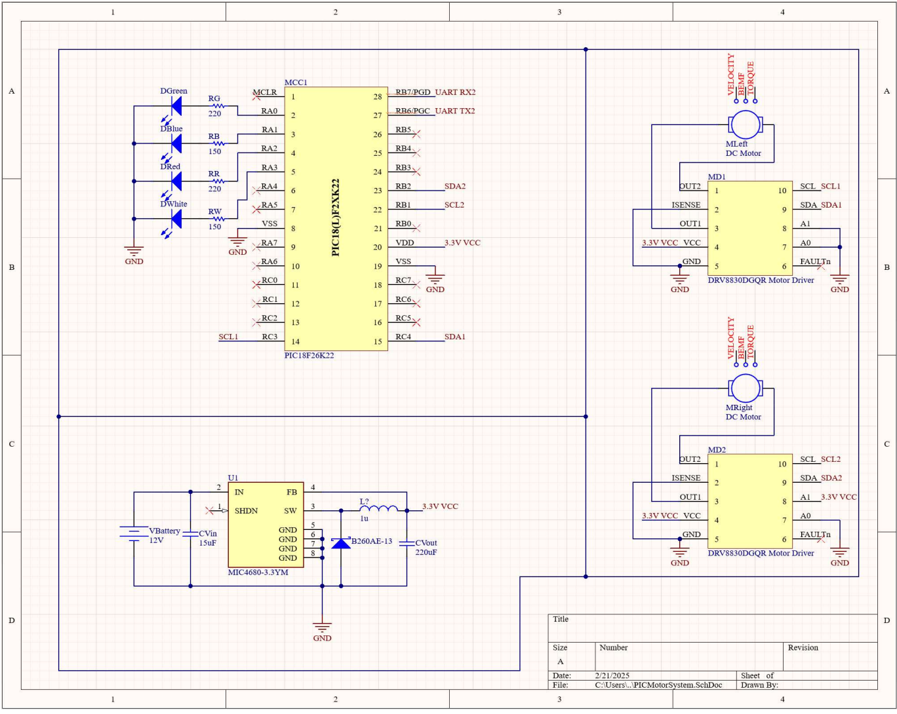
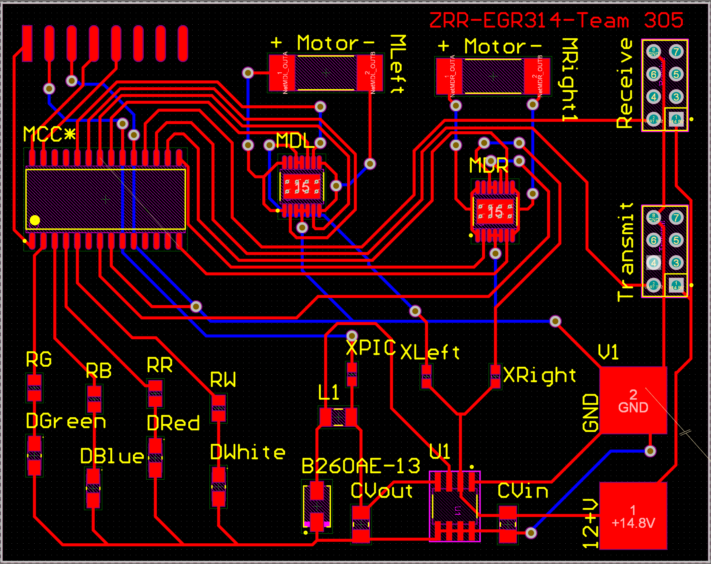
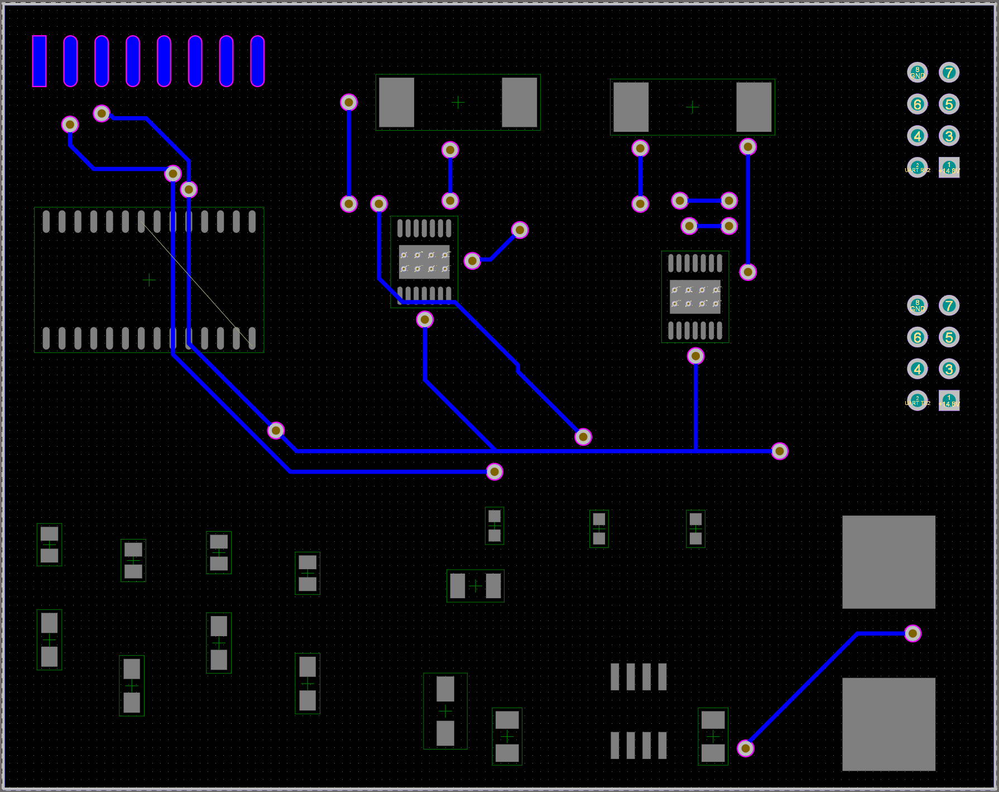
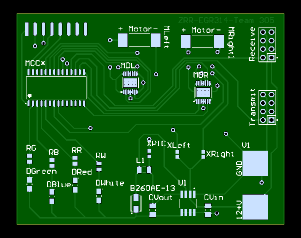
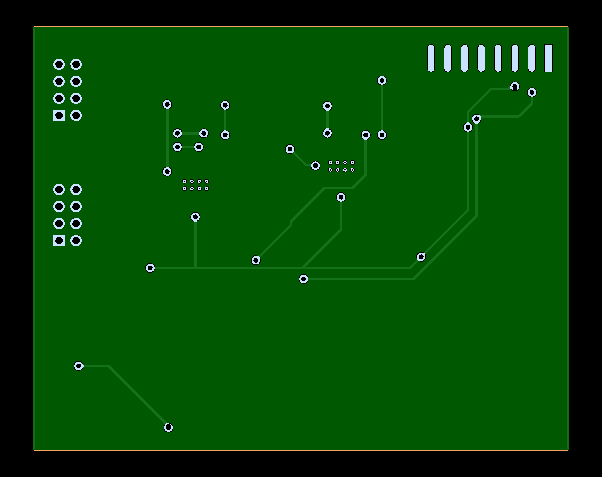

# **Schematic & PCB**
[Download ZIP](images/EGR314_MotorSubsystem (5-5-2025 4-15-22 PM).zip)

## **Schematic Design**

[View PDF](images/EGR314MotorSystem.pdf)

## **PCB**
### **PCB Design**

### **Final PCB**

[Download Gerber Files](images/PCB.zip)

## **Schematic Functionality**

1. Main Control Using the PIC Microcontroller
At the heart of the system is a PIC microcontroller, aligning with the specified requirement to use this microcontroller family for compatibility, availability, and existing development toolchains. The PIC handles all logic, coordination, and data processing tasks, enabling centralized control over system functions. This ensures consistent performance and simplifies firmware development and debugging.

2. Inter-System Communication via UART
Communication with external systems is handled through an 8-pin header utilizing UART protocol, which satisfies the product requirement for simple, low-overhead serial communication. UART is a robust and well-supported protocol ideal for short-distance, point-to-point communication, making it suitable for sending commands or status information between subsystems. This design choice ensures interoperability, expandability, and ease of integration in a broader system.

3. Feedback and Diagnostic Capability with Debug LEDs
User needs for maintainability and transparency are addressed through the inclusion of four debug LEDs. These serve as visual indicators for changes in system status or errors, allowing developers or operators to quickly identify issues without the need for external debugging tools. The LEDs support real-time feedback, helping diagnose issues like communication failures or malformed commands, which enhances reliability and user trust in the system.

4. Dual Voltage Power Distribution
Power distribution is thoughtfully designed to satisfy both efficiency and compatibility. A 9V primary power source is stepped down to 3.3V via a switching regulator, which powers the microcontroller and logic-level components like SPI interfaces. This fulfills the voltage and power efficiency requirements while ensuring compatibility with the 3.3V logic levels used by the PIC microcontroller. Meanwhile, keeping certain high-current components—such as motors—on the 9V rail ensures adequate power delivery without brownouts, supporting the system's mechanical performance requirements.

5. High-Speed, Logic-Level Motor Control via SPI
The motor drivers are connected to the PIC microcontroller through SPI, a high-speed synchronous interface. This choice supports efficient motor command delivery with minimal latency and reduced overhead compared to asynchronous protocols. SPI also ensures that 3.3V logic signals from the PIC are correctly interpreted by the motor drivers, even while they are powered by 9V for sufficient torque and speed output. This dual compatibility fulfills both electrical and functional requirements—achieving fast, reliable motor control while ensuring proper logic-level interfacing.

## **Version 2.0**
In developing a Version 2.0 of the hardware design, several key areas could be improved to enhance reliability, expandability, and ease of development. While the current schematic, featuring a PIC microcontroller, UART communication, SPI-controlled motor drivers, and a regulated 3.3V and 9V power supply, meets functional requirements, the development process revealed several opportunities for refinement.

A major improvement would be allocating more time during the early stages to fully understand the interactions between subsystems, particularly communication protocols like SPI and UART. While datasheets provide essential guidance, they often don’t reveal practical integration challenges, such as timing issues, voltage mismatches, or signal integrity problems. In Version 1.0, much of the system integration had to be handled simultaneously, which made debugging more complex and time consuming.

To address this in Version 2.0, we would emphasize breadboard prototyping of each subsystem using the exact components from the final design. This hands-on approach would allow incremental testing and validation, especially of SPI communication between the PIC microcontroller and multiple peripheral devices. SPI, while fast and reliable, can introduce complexity when multiple devices share the same bus. Testing these interactions early on could lead to a more robust final design, including improvements such as additional chip select lines, better signal routing, or isolation components to reduce noise.

The most important takeaway for future improvements is this: test, test, test. If more time had been given to prototype each subsystem individually, particularly the motor drivers in this project, there would have been a better opportunity to program them correctly, understand their behavior, and determine if they were the right solution in the first place. Testing not only builds confidence in the system but also reveals hidden issues that can’t always be predicted through datasheets alone.

Therefore, Version 2.0 should focus on early, thorough testing of each component and subsystem. This would result in a far more stable, functional, and reliable design.
